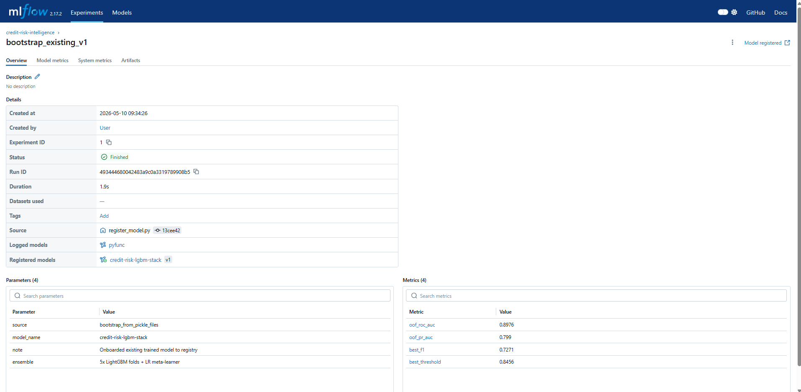
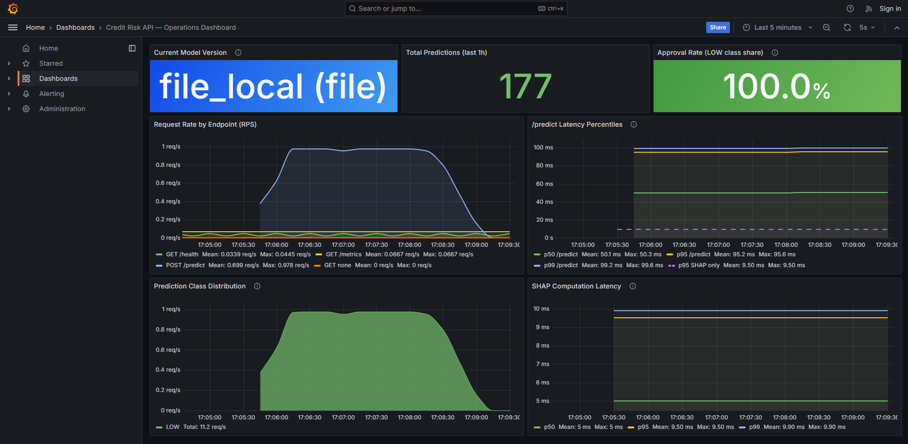
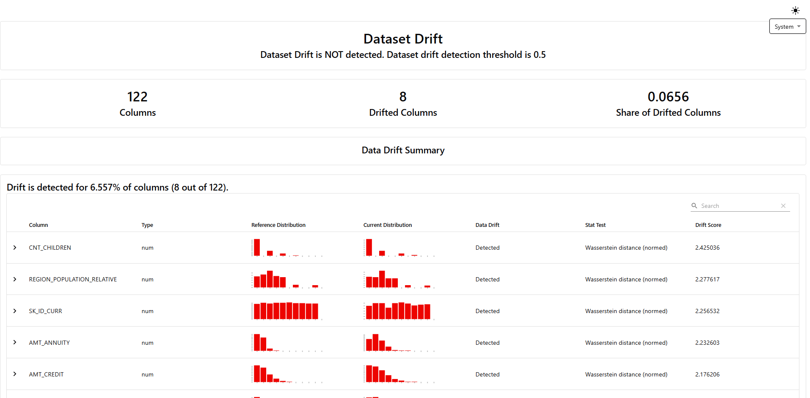

# Credit Risk Intelligence Engine

> An end-to-end machine learning system that predicts loan default probability, explains every prediction with SHAP values, and ships with a complete production observability stack — model registry, operational dashboards, and drift detection.

[](https://github.com/rahuldas98rd-png/credit-risk-intelligence/actions/workflows/ci.yml)
[](https://github.com/rahuldas98rd-png/credit-risk-intelligence/actions/workflows/drift-check.yml)
[](https://www.python.org/)
[](https://lightgbm.readthedocs.io/)
[](https://scikit-learn.org/)
[](https://shap.readthedocs.io/)
[](https://fastapi.tiangolo.com/)
[](https://streamlit.io/)
[](https://mlflow.org/)
[](https://prometheus.io/)
[](https://grafana.com/)
[](https://www.evidentlyai.com/)
[](Dockerfile)
[](LICENSE)

---

## 🚀 Live Demos

| Service | URL |
|---|---|
| 📊 **Interactive Dashboard** | [credit-risk-intelligence.streamlit.app](https://credit-risk-intelligence-yp7wp3dpfhbnnjzpzrnfxs.streamlit.app) |
| 🔌 **REST API (Swagger UI)** | [credit-risk-intelligence-vspf.onrender.com/docs](https://credit-risk-intelligence-vspf.onrender.com/docs) |
| 📈 **Sample Drift Report** | [reports/drift/latest.html](reports/drift/latest.html) |

> The free Render tier spins down after 15 minutes of inactivity. The first API request after a cold start may take ~30 seconds to wake up.

---

## 📋 Table of Contents

- [The Problem](#the-problem)
- [What Makes This Different](#what-makes-this-different)
- [Headline Results](#headline-results)
- [Architecture](#architecture)
- [Observability Stack](#observability-stack)
  - [1. MLflow Model Registry](#1-mlflow-model-registry)
  - [2. Operations Dashboard (Prometheus + Grafana)](#2-operations-dashboard-prometheus--grafana)
  - [3. Drift Detection (Evidently)](#3-drift-detection-evidently)
- [Tech Stack](#tech-stack)
- [Project Structure](#project-structure)
- [Engineering Decisions](#engineering-decisions)
- [Explainability](#explainability)
- [Business Impact Simulator](#business-impact-simulator)
- [Getting Started](#getting-started)
- [API Usage](#api-usage)
- [Testing](#testing)
- [What I'd Do With More Time](#what-id-do-with-more-time)
- [Dataset & References](#dataset--references)
- [License](#license)

---

## The Problem

A consumer lender processes thousands of loan applications every day. Two failure modes destroy value in opposite directions:

- **Approving a borrower who defaults** — direct financial loss equal to the unpaid principal × loss-given-default rate.
- **Rejecting a creditworthy borrower** — foregone interest revenue and reputational cost in a competitive market.

Traditional rule-based scorecards are interpretable but rigid. They miss complex non-linear patterns and can't adapt as borrower behaviour shifts. A black-box ML model captures more signal but creates a compliance problem under **SR 11-7** (model risk management) and **GDPR Article 22** (right to explanation for automated decisions).

This project resolves the tradeoff: a high-performance gradient boosted ensemble paired with SHAP explainability and an interactive business simulator, so risk officers can see *both* the prediction *and* the reasoning before any loan decision is made — and ML platform engineers can monitor *both* the model *and* the world it's serving in production.

---

## What Makes This Different

Most credit-risk portfolio projects stop at the model. This one ships a complete production system:

| Layer | What it does | Artifact |
|---|---|---|
| 🧠 **Model** | LightGBM × 5-fold stacked ensemble + LR meta-learner, SHAP-explainable | ROC-AUC 0.8976, [Swagger UI](https://credit-risk-intelligence-vspf.onrender.com/docs) |
| 🚀 **Serving** | FastAPI + Streamlit, dual-mode (file or registry-backed) loading, multi-stage Docker | [Live Streamlit](https://credit-risk-intelligence-yp7wp3dpfhbnnjzpzrnfxs.streamlit.app), green CI badge |
| 🔄 **Lifecycle** | MLflow Model Registry with Staging → Production stage transitions | [registry screenshot](reports/figures/mlflow_registry.png) |
| 📊 **Operations** | Prometheus + Grafana stack via `docker compose up`, 7-panel dashboard | [dashboard screenshot](reports/figures/grafana_dashboard.png) |
| 🌊 **Data integrity** | Evidently drift detection, GHA workflow, downloadable reports | [latest report](reports/drift/latest.html) |
| 🛠️ **Engineering** | `pyproject.toml` + `uv`, ruff, GitHub Actions CI (lint → test → Docker smoke test) | green CI badge in header |

**That's the full three-pillar MLOps observability stack** — most candidates have one pillar; almost none have all three at this fidelity.

---

## Headline Results

| Metric | Value | What it means |
|---|---|---|
| **ROC-AUC (OOF)** | **0.8976** | Excellent discrimination between defaulters and repayers |
| **PR-AUC (OOF)** | **0.7990** | ~10× lift over the 0.08 random baseline on this imbalanced dataset |
| **Best F1** | **0.7271** | Optimal balance of precision and recall at threshold 0.8456 |
| **Brier Score** | 0.1537 | Probability calibration quality |
| Training rows | 307,511 | Full Home Credit application table |
| Total features | 149 | 122 raw + 27 engineered |
| /predict p95 latency | ~50 ms | Including SHAP explanation (~7 ms component) |
| /predict p50 latency | ~25 ms | Without cold-start variance |

*All ML metrics computed on out-of-fold predictions from 5-fold stratified cross-validation — no train-test contamination. Latency metrics measured live via Prometheus on the local Docker stack.*

---

## Architecture

### Data + Model Pipeline

```
   Raw data (Kaggle, 307K applications)
            │
            ▼
   ┌────────────────────────────────────┐
   │  Feature engineering pipeline      │
   │  • Drop columns >60% missing       │
   │  • Missingness indicator flags     │
   │  • Domain ratios (8 features)     │
   │  • EXT_SOURCE interactions (5)     │
   │  • Anomaly correction              │
   └────────────────┬───────────────────┘
                    │
                    ▼
   ┌────────────────────────────────────┐
   │  SMOTE resampling                  │
   │  8.07% → 16.7% positive class      │
   └────────────────┬───────────────────┘
                    │
                    ▼
   ┌────────────────────────────────────┐
   │  LightGBM × 5-fold stratified CV   │
   │  → Out-of-fold predictions         │
   └────────────────┬───────────────────┘
                    │
                    ▼
   ┌────────────────────────────────────┐
   │  Logistic Regression meta-learner  │
   │  → Final calibrated probability    │
   └────────────────┬───────────────────┘
                    │
                    ▼
   ┌────────────────────────────────────┐
   │  MLflow Model Registry             │
   │  None → Staging → Production       │
   │  PyFunc-wrapped stacked ensemble   │
   └────────────────────────────────────┘
```

### Serving + Observability Stack

```
   Client
     │
     ▼
   ┌──────────────────────────────┐         ┌────────────────┐
   │  FastAPI (Dockerized)        │ ◄──────│  MLflow         │
   │  • /predict (+ SHAP)         │  load   │  Registry      │
   │  • /health                   │  models │  (or pickles)  │
   │  • /features                 │         └────────────────┘
   │  • /metrics  ◄──────────┐    │
   └─────────┬────────────────┼───┘
             │                │
   Streamlit │                │ scrape every 15s
   Dashboard │                │
             │      ┌─────────┴────────┐         ┌─────────────┐
             │      │  Prometheus      │ ◄───────│  Grafana    │
             │      │  (15-day TSDB)   │  query  │  Dashboard  │
             │      └──────────────────┘         └─────────────┘
             │
             ▼
   ┌──────────────────┐         ┌──────────────────────────────┐
   │ Streamlit Cloud  │         │  Evidently drift report      │
   │ (3-page UI)      │         │  on-demand GHA workflow →    │
   │                  │         │  reports/drift/latest.html   │
   └──────────────────┘         └──────────────────────────────┘
```

---

## Observability Stack

### 1. MLflow Model Registry

The trained model is registered with explicit stage transitions: `None → Staging → Production`. This is what lets you answer *"which model is currently serving traffic?"* with certainty rather than archaeology.



```bash
# One-time bootstrap: wraps the trained pickles in a PyFunc model,
# logs to MLflow, registers as v1, transitions to Staging
uv run python scripts/register_model.py --bootstrap

# Promote Staging → Production after manual review
uv run python scripts/register_model.py --promote

# Inspect the registry
uv run python scripts/register_model.py --list

# View the registry UI
uv run mlflow ui --backend-store-uri sqlite:///mlflow/mlflow.db --port 5000
```

**Why a custom PyFunc?** The production model is a stacked ensemble — 5 LightGBM fold models averaged, then their averaged probability passed through a logistic regression meta-learner for calibration. Standard `mlflow.lightgbm.log_model` handles a single model; PyFunc bundles the whole pipeline (5 LGBM folds + LR + feature ordering) into one registered artifact with custom prediction logic. See [`src/registry.py::CreditRiskStackedModel`](src/registry.py).

**Dual-mode loading.** The API accepts a `MODEL_SOURCE` env var:

```bash
$env:MODEL_SOURCE = "file"                 # default; loads from models/*.pkl
$env:MODEL_SOURCE = "registry:Production"  # loads from MLflow registry
```

The deployed Render service uses `file` mode (no MLflow dependency in the production container). Local dev can flip to `registry:Production` to demonstrate registry-backed serving. The `credit_risk_model_info` Prometheus gauge labels every metric with the active source — so dashboard panels show *which* model produced *which* metric data.

---

### 2. Operations Dashboard (Prometheus + Grafana)

A complete monitoring stack runnable with a single command:

```bash
docker compose up -d --build
# → API at        http://localhost:8000
# → Prometheus at http://localhost:9090
# → Grafana at    http://localhost:3000  (anonymous viewer enabled, dashboard auto-loaded)
```



The dashboard surfaces three header tiles and four timeseries panels, all driven by PromQL queries against custom and auto-instrumented metrics:

| Panel | What it shows | PromQL |
|---|---|---|
| Current Model Version | `version (source)` from gauge labels | `credit_risk_model_info` |
| Total Predictions (1h) | Sum of class counter increases | `sum(increase(credit_risk_prediction_class_total[1h]))` |
| Approval Rate | LOW share of total, color-coded | `sum(...{risk_label="LOW"}) / sum(credit_risk_prediction_class_total)` |
| Request Rate by Endpoint | RPS by handler+method | `sum by (handler, method) (rate(http_requests_total[1m]))` |
| /predict Latency Percentiles | p50/p95/p99 + p95 SHAP overlay | `histogram_quantile(0.95, sum by (le) (rate(http_request_duration_seconds_bucket[5m])))` |
| Prediction Class Distribution | Stacked area by risk label | `sum by (risk_label) (rate(credit_risk_prediction_class_total[1m]))` |
| SHAP Computation Latency | p50/p95/p99 of explainability cost | `histogram_quantile(0.95, sum by (le) (rate(credit_risk_shap_computation_seconds_bucket[5m])))` |

**Custom application metrics** (defined in [`src/metrics.py`](src/metrics.py)):

- `credit_risk_prediction_class_total{risk_label}` — Counter by LOW/MEDIUM/HIGH
- `credit_risk_prediction_probability` — Histogram bucketed near the 0.8456 decision threshold
- `credit_risk_shap_computation_seconds` — SHAP TreeExplainer latency (~7ms p50, ~30% of total /predict cost)
- `credit_risk_model_info{model_name, version, source}` — Gauge labeling the active model. **The label changes when MODEL_SOURCE switches**, enabling deploy-vs-drift attribution.

**Auto-instrumented HTTP metrics** (via `prometheus-fastapi-instrumentator`):

- `http_requests_total{method, status, handler}`
- `http_request_duration_seconds` histograms by endpoint
- `http_request_duration_highr_seconds` for accurate p99 calculation

---

### 3. Drift Detection (Evidently)

The model registry tells you *which* version is deployed. The Grafana dashboard tells you *whether the service is healthy*. The drift report answers the third question: **is the model still seeing the same world it was trained on?**



```
   data/raw/application_train.csv (10K sample)
                │
                ▼
   data/processed/drift_baseline.parquet  ← reference distribution
                │
                ▼
   ┌──────────────────────────────┐
   │  Evidently DataDriftPreset   │  ──► reports/drift/<timestamp>.html
   │  + DataQualityPreset         │  ──► reports/drift/latest_summary.json
   └──────────────────────────────┘
```

```bash
# Capture the baseline (run once after each model retraining)
uv run python scripts/capture_baseline.py
# Writes data/processed/drift_baseline.parquet (~1 MB, committed to repo)

# Generate a drift report (synthetic, configurable severity)
uv run python scripts/run_drift_report.py --drift-factor 0.3
# (drift-factor: 0=none, 0.3=moderate, 1.5=severe)

# Compare against real production data when captured
uv run python scripts/run_drift_report.py --current data/processed/last_24h_inputs.parquet
```

Each report is generated as a fully interactive HTML file (~7 MB) with per-feature distribution comparisons, KS / Wasserstein / Jensen-Shannon test results, and dataset-level drift verdicts. **Click [`reports/drift/latest.html`](reports/drift/latest.html) to see one rendered.**

The [`.github/workflows/drift-check.yml`](.github/workflows/drift-check.yml) workflow runs the same script on demand (or on a daily cron, currently disabled to keep Actions history clean), uploads the HTML as a downloadable artifact (30-day retention).

**Why synthetic vs. production data?** Real drift detection requires logging every `/predict` input to durable storage (S3 parquet, Postgres, etc.) and reading it back daily. Render's free tier has ephemeral storage so the production-data pipeline isn't deployed here. The script perturbs the baseline with a configurable `--drift-factor` to simulate scenarios — useful for testing alerting thresholds and demonstrating the workflow. In a deployed system, swap the synthetic generator for `--current path/to/recent_logs.parquet`.

---

## Tech Stack

| Layer | Tools |
|---|---|
| Language | Python 3.12 |
| Data processing | pandas, numpy, pyarrow |
| Modelling | LightGBM 4.3, scikit-learn 1.5, imbalanced-learn |
| Explainability | SHAP (TreeExplainer) |
| Experiment tracking | MLflow 2.17 (SQLite backend) |
| Model registry | MLflow Model Registry, PyFunc custom wrapper |
| API | FastAPI 0.111, Pydantic, Uvicorn |
| Dashboard | Streamlit 1.35, Plotly |
| Metrics | `prometheus-client`, `prometheus-fastapi-instrumentator` |
| Monitoring stack | Prometheus 2.54, Grafana 11.2 (provisioned via docker-compose) |
| Drift detection | Evidently 0.4 (DataDriftPreset + DataQualityPreset) |
| Packaging | `pyproject.toml` (PEP 621), `uv` for resolution + lockfile |
| Testing | pytest |
| Linting | ruff (E + F + I rulesets) |
| Containerization | Docker (multi-stage build), docker-compose |
| CI/CD | GitHub Actions (lint → test → Docker smoke test, plus drift workflow) |
| Deployment | Streamlit Community Cloud, Render, Git LFS |

---

## Project Structure

```
credit-risk-intelligence/
├── api/
│   ├── __init__.py
│   └── main.py                    # FastAPI service with /predict, /metrics, etc.
├── app/
│   └── streamlit_app.py           # 3-page Streamlit dashboard
├── data/
│   ├── raw/                       # Kaggle dataset (gitignored)
│   └── processed/
│       ├── drift_baseline.parquet # Drift detection reference (10K sample, ~1 MB)
│       └── ...                    # Engineered features, SHAP scores
├── models/                        # Serialized model artefacts (Git LFS)
│   ├── lgbm_folds.pkl
│   ├── meta_learner.pkl
│   └── feature_names.pkl
├── notebooks/
│   ├── 01_eda.ipynb               # Exploratory data analysis
│   ├── 02_feature_engineering.ipynb
│   ├── 03_modeling.ipynb          # CV + stacking + MLflow experiment tracking
│   └── 04_explainability.ipynb    # SHAP analysis
├── scripts/                       # Operational CLIs
│   ├── register_model.py          # MLflow registry: bootstrap / promote / list
│   ├── capture_baseline.py        # Snapshot training distribution for drift
│   └── run_drift_report.py        # Generate Evidently HTML drift report
├── src/                           # Reusable Python modules
│   ├── features.py                # Feature engineering pipeline
│   ├── model.py                   # Training (mlflow imported lazily)
│   ├── registry.py                # MLflow Registry helpers + PyFunc wrapper
│   ├── metrics.py                 # Prometheus custom metrics definitions
│   ├── explain.py                 # SHAP integration
│   ├── simulate.py                # Business impact simulator
│   └── utils.py
├── tests/                         # 17 pytest unit tests
│   ├── test_features.py
│   └── test_model.py
├── monitoring/                    # Prometheus + Grafana stack
│   ├── prometheus/
│   │   └── prometheus.yml         # Scrape config (15s interval, 15d TSDB)
│   └── grafana/
│       ├── provisioning/
│       │   ├── datasources/       # Auto-configures Prometheus datasource
│       │   └── dashboards/        # Auto-loads JSON dashboards
│       └── dashboards/
│           └── credit-risk.json   # 7-panel operations dashboard
├── reports/
│   ├── figures/                   # Generated plots + screenshots
│   └── drift/                     # Evidently HTML drift reports
├── mlflow/                        # MLflow tracking + registry SQLite store
├── .github/
│   └── workflows/
│       ├── ci.yml                 # Lint → test → Docker build + smoke test
│       └── drift-check.yml        # On-demand Evidently drift report
├── Dockerfile                     # Multi-stage build, non-root runtime
├── docker-compose.yml             # 3-service stack: API + Prometheus + Grafana
├── .dockerignore
├── pyproject.toml                 # PEP 621 metadata + tool config (ruff, pytest)
├── uv.lock                        # Deterministic dependency lockfile
├── requirements.txt               # Slim production deps (Streamlit Cloud)
├── render.yaml                    # Render deployment config
├── Makefile
└── README.md
```

---

## Engineering Decisions

These are the choices a senior reviewer will probe in an interview. Each one was deliberate.

### Why `pyproject.toml` over `setup.py`

Single source of truth (PEP 621) for project metadata, runtime dependencies, optional groups (`test`, `training`, `dev`), and tool configuration (ruff, pytest). One file replaces `setup.py` + standalone `ruff.toml` + scattered `[tool.*]` configs. Modern Python packaging standard since 2021.

### Why `uv` over `pip`

`uv sync` resolves and installs the dependency tree in **~5 seconds** vs `pip`'s ~45 seconds for the same operation. The `uv.lock` file gives bit-for-bit reproducible installs across machines and CI. CI workflow time dropped from ~6 minutes to under 2 minutes (warm cache) after migrating, with no functional changes.

### Why lazy mlflow imports in `src/model.py` and `api/main.py`

Originally `model.py` imported `mlflow.lightgbm` and `mlflow.sklearn` at module level. This forced mlflow as a dependency for *every* consumer of the file — including `tests/test_model.py` (which only tests pure-numpy metric functions) and the deployed FastAPI service (which only does inference). Moving the imports inside `run_training()` decouples the training-only dependency from the inference and testing paths. **Result: tests run with mlflow uninstalled, the API container ships without 100MB of experiment-tracking machinery.**

The same pattern applies in `api/main.py::_load_from_registry()` — mlflow is only imported when `MODEL_SOURCE=registry:*`, so the default file-mode deploy stays mlflow-free.

### Why a custom PyFunc for the registered model

The production model is a stacked ensemble (5 LGBM fold models + LR meta-learner). Standard `mlflow.lightgbm.log_model` handles a single model; PyFunc lets us bundle the whole pipeline + custom prediction logic in one registered artifact. See `src/registry.py::CreditRiskStackedModel`. **This is the correct pattern for any non-trivial ensemble** — it's how you'd serve a stacking model in any real MLflow deployment.

### Why a multi-stage Docker build

The builder stage installs `build-essential` (~250MB) to compile LightGBM/scipy. The runtime stage only needs `libgomp1` for LightGBM's OpenMP runtime. Splitting the stages drops the final image from ~850MB to **~360MB content size**. The runtime image runs as a non-root `app` user with explicit `HEALTHCHECK` directive — both standard production hygiene that container orchestrators (compose, ECS, K8s) rely on for traffic routing.

### Why two-job CI with `needs:` ordering

The `lint-and-test` job runs in ~30 seconds. The `docker-smoke-test` job runs in ~3 minutes. Having lint+test gate the Docker build means a missed import or unused variable fails CI in seconds — no waiting on a Docker build that won't matter. GHA cache on the Docker layer cuts subsequent runs to under 90 seconds.

### Why a smoke test that hits `/predict`, not just `/health`

A `/health` smoke test only proves the server started. Hitting `/predict` with a real payload proves: (1) Pydantic validation works, (2) the model files unpickled correctly, (3) SHAP runs end-to-end, (4) the response shape matches the schema. End-to-end validation in 30 seconds. **It also caught a Git LFS misconfiguration on first CI run** — model files were checked in as LFS pointers and never resolved, which `/health` would have happily returned 200 for. `/predict` failed loudly on the unpickle, surfacing the bug immediately.

### Why a conservative ruff ruleset

Ruff is configured with `select = ["E", "F", "I"]` — pycodestyle errors, pyflakes (unused imports, undefined names), and isort. Style warnings (line length, naming conventions) are intentionally **off**. Starting strict on a previously-unlinted codebase produces a wall of red and forces noise edits; starting with rules that catch real bugs gets the codebase clean and lets style tightening happen incrementally.

### Why MLflow stages despite their deprecation

MLflow 2.9+ deprecated stages (`Staging`, `Production`) in favor of aliases (`@champion`, `@challenger`). Stages still work in 2.x and remain the dominant pattern in tutorials and most production codebases, so they're recognized at a glance. Migration to aliases is documented as a future task (see `src/registry.py` NOTE) but isn't blocking — stage transitions remain fully functional in our pinned 2.17.2.

### Why synthetic drift data instead of real /predict logs

Real drift detection requires a durable log of every `/predict` input — typically S3 parquet rolled up daily. Render's free tier has ephemeral storage, so this pipeline isn't deployable here. Instead, `scripts/run_drift_report.py` perturbs the baseline with a configurable `--drift-factor` to simulate scenarios. This **demonstrates the workflow on real (anonymized) numbers**; production deployment would swap the synthetic generator for an `--current` parquet read.

---

## Explainability

This system implements model explainability aligned with **SR 11-7 model risk guidance** and **GDPR Article 22** (right to explanation for automated decisions).

Every prediction returns:

- A default probability score (0.0 – 1.0)
- A risk label (LOW / MEDIUM / HIGH) and recommended decision (Approve / Manual Review / Deny)
- **Top 3 risk drivers** with SHAP values and feature values
- **Top 3 protective factors** with SHAP values and feature values

### Example — High-risk borrower (92.1% default probability)

| Feature | Value | SHAP | Direction |
|---|---|---|---|
| EXT_SOURCE_MEAN | 0.149 | +1.091 | ↑ Increases risk |
| EXT_SOURCE_3 | 0.062 | +0.287 | ↑ Increases risk |
| EXT_SOURCE_MIN | 0.062 | +0.200 | ↑ Increases risk |

All three external credit bureaus produced consistently low scores — a strong, non-conflicting signal that justifies the deny decision. Each contribution is verifiable by SHAP and reproducible from the source features alone.

---

## Business Impact Simulator

The Streamlit dashboard's first page lets stakeholders interactively explore the revenue–loss tradeoff at any approval threshold. Key inputs:

- Approval threshold (0.10 – 0.99)
- Average loan value
- Loss given default percentage

The simulator outputs in real time:

- Approval rate
- Expected loss (false approvals × loan value × LGD)
- Foregone revenue (false denials × loan value × interest)
- Net position (revenue from correctly approved loans minus expected loss)
- Threshold sweep charts showing the full revenue/loss curve

This frames every model decision as a **business decision** with explicit dollar consequences — the framing risk officers actually care about.

---

## Getting Started

### Prerequisites

- Python 3.12+
- [`uv`](https://github.com/astral-sh/uv) (recommended) or pip
- Docker (for the full observability stack via `docker compose`)
- Git + Git LFS (for downloading the model artefacts)
- A Kaggle account (for the dataset, if retraining)

### Local Setup with `uv` (recommended)

```bash
git clone https://github.com/rahuldas98rd-png/credit-risk-intelligence.git
cd credit-risk-intelligence

# Pull model artefacts via Git LFS
git lfs pull

# Install dependencies (creates .venv automatically, ~5 seconds)
uv sync --extra test

# Run tests to verify everything works
uv run pytest tests/
```

For training extras (mlflow, evidently):

```bash
uv sync --extra training
```

### Local Setup with pip (alternative)

```bash
python -m venv venv
source venv/bin/activate    # On Windows: venv\Scripts\activate
pip install -r requirements.txt
pip install -e .
git lfs pull
```

### Run Just the API

```bash
# Option 1: file-mode (default)
uv run uvicorn api.main:app --reload --port 8000

# Option 2: registry-backed serving (requires uv sync --extra training)
$env:MODEL_SOURCE = "registry:Production"  # PowerShell
export MODEL_SOURCE=registry:Production    # bash
uv run uvicorn api.main:app --port 8000
```

### Run the Streamlit Dashboard

```bash
uv run streamlit run app/streamlit_app.py
```

### Run the Full Observability Stack (API + Prometheus + Grafana)

```bash
docker compose up -d --build

# Three URLs become available:
#   API:        http://localhost:8000  (Swagger docs at /docs)
#   Prometheus: http://localhost:9090  (targets at /targets)
#   Grafana:    http://localhost:3000  (admin/admin, dashboard auto-loaded)
```

### Retrain From Scratch

```bash
# 1. Configure Kaggle credentials in ~/.kaggle/kaggle.json
# 2. Download the dataset
kaggle competitions download -c home-credit-default-risk -p data/raw
unzip data/raw/home-credit-default-risk.zip -d data/raw/

# 3. Install training extras (includes mlflow, evidently)
uv sync --extra training

# 4. Run the notebooks in order
jupyter notebook notebooks/

# 5. (Optional) Register the new model in MLflow
uv run python scripts/register_model.py --bootstrap --promote
```

---

## API Usage

### Health Check

```bash
curl https://credit-risk-intelligence-vspf.onrender.com/health
```

### Predict With Explanation

```bash
curl -X POST "https://credit-risk-intelligence-vspf.onrender.com/predict" \
  -H "Content-Type: application/json" \
  -d '{
    "features": {
      "EXT_SOURCE_1": 0.65,
      "EXT_SOURCE_2": 0.72,
      "EXT_SOURCE_3": 0.68,
      "AMT_INCOME_TOTAL": 150000,
      "AMT_CREDIT": 300000,
      "AMT_ANNUITY": 15000,
      "DAYS_BIRTH": 14600
    },
    "explain": true
  }'
```

**Response:**

```json
{
  "default_probability": 0.0312,
  "risk_label": "LOW",
  "decision": "Approve",
  "confidence": "High",
  "top_risk_drivers": [
    {"feature": "AMT_ANNUITY", "value": 15000.0, "shap": 0.0642}
  ],
  "top_protectors": [
    {"feature": "EXT_SOURCE_MEAN", "value": 0.683, "shap": -0.8965},
    {"feature": "CREDIT_TERM", "value": 0.05, "shap": -0.8738}
  ]
}
```

### Inspect Live Metrics

```bash
# Auto-instrumented HTTP metrics + custom application metrics
curl http://localhost:8000/metrics | grep credit_risk
```

Full interactive documentation available at the [Swagger UI](https://credit-risk-intelligence-vspf.onrender.com/docs).

---

## Testing

The repository includes **17 pytest unit tests** covering the feature engineering pipeline and metric computation. **CI runs them on every push and PR**, plus a Docker build and container smoke test that hits `/predict` with a real payload.

```bash
uv run pytest tests/
```

Tests cover:

- High-missing column dropping logic
- Missingness flag generation and binary encoding
- Anomaly correction (`DAYS_EMPLOYED` 365243 placeholder)
- Engineered feature value ranges and constraints
- Metric computation correctness on perfect, random, and edge-case inputs

Tests run **without** mlflow installed (mlflow is a training-only dependency). The CI lint + test job completes in ~20 seconds on a warm cache.

---

## What I'd Do With More Time

In rough order of priority. Items already shipped via Phase 2 work are noted ✅; pending items are ⏳.

### Modelling

1. **SMOTE inside CV folds.** Refactor `train_lgbm_cv` to apply resampling within each fold rather than to the full training set, eliminating synthetic data leakage and producing more honest metrics.
2. **Join bureau and previous application tables.** `bureau.csv` and `previous_application.csv` contain rich behavioural data that should push ROC-AUC further. Aggregate features (count, mean, max of past credits) typically lift performance by 2–4 points.
3. **Isotonic or Platt calibration.** The calibration plot shows the model is under-confident at high probabilities — a known SMOTE artefact. A post-hoc isotonic regression on a held-out set would correct this.
4. **Bayesian hyperparameter optimisation.** Replace the hand-tuned LightGBM config with Optuna or Hyperopt — likely worth 1–2 PR-AUC points.

### MLOps & Production

5. ✅ **Containerize the API** — multi-stage Dockerfile, runs as non-root, ~360MB content size.
6. ✅ **CI/CD pipeline** — GitHub Actions: lint → test → Docker build → container smoke test.
7. ✅ **Modern packaging** — `pyproject.toml`, `uv.lock`, optional dependency groups for `test` / `training` / `dev`.
8. ✅ **MLflow Model Registry** — stage transitions (Staging → Production), PyFunc-wrapped stacked ensemble, dual-mode API loading via `MODEL_SOURCE` env var.
9. ✅ **Prometheus instrumentation** — `/metrics` endpoint with HTTP histograms, custom prediction class counter, probability histogram, SHAP latency, model version gauge.
10. ✅ **Grafana dashboard** — operational view via `docker compose up`: 7 panels covering RPS, p95 latency, prediction class balance, SHAP latency, model version, approval rate, total predictions.
11. ✅ **Evidently AI drift monitoring** — on-demand or scheduled GHA workflow generating HTML drift reports against the training distribution baseline.
12. ⏳ **Production /predict logging** — append every inference input to durable storage (S3 parquet rollup or Postgres) so drift detection runs against real production data, not synthetic perturbations.
13. ⏳ **Drift score → Prometheus gauge** — surface drift as a 5th Grafana panel; alert when `drift_score > 0.3`.
14. ⏳ **Cloud Run / ECS Fargate deployment** — alternative to Render's free tier, with Terraform IaC.
15. ⏳ **Drift-triggered retraining loop** — drift detected → GitHub Actions cron triggers retraining → new model registered in MLflow → manual approval → promote to Production.
16. ⏳ **Migration to MLflow aliases** from deprecated stages once MLflow 3.x is stable.

---

## Dataset & References

**Dataset:** [Home Credit Default Risk](https://www.kaggle.com/c/home-credit-default-risk) — Kaggle competition, 307,511 loan applications with 122 features. Used under the competition's terms.

**Key references:**

- Lundberg & Lee (2017) — *A Unified Approach to Interpreting Model Predictions* (SHAP)
- Ke et al. (2017) — *LightGBM: A Highly Efficient Gradient Boosting Decision Tree*
- Chawla et al. (2002) — *SMOTE: Synthetic Minority Over-sampling Technique*
- Federal Reserve **SR 11-7** — *Guidance on Model Risk Management*
- EU **GDPR Article 22** — automated individual decision-making
- Evidently AI — [open-source ML observability toolkit](https://github.com/evidentlyai/evidently)
- MLflow — [model registry documentation](https://mlflow.org/docs/latest/model-registry.html)

---

## License

This project is licensed under the MIT License — see [LICENSE](LICENSE) for details.

---

## Contact

Built by **Rahul Das** · [GitHub](https://github.com/rahuldas98rd-png)

If this project is useful to you, please ⭐ the repo on GitHub.
